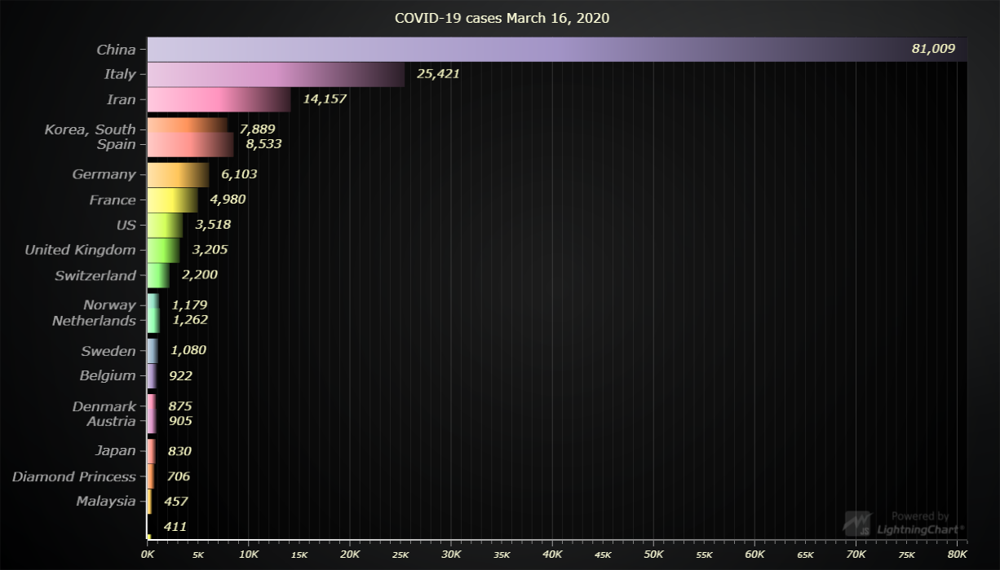

# JavaScript COVID-19 Tracker Chart



This demo application belongs to the set of examples for LightningChart JS, data visualization library for JavaScript.

LightningChart JS is entirely GPU accelerated and performance optimized charting library for presenting massive amounts of data. It offers an easy way of creating sophisticated and interactive charts and adding them to your website or web application.

The demo can be used as an example or a seed project. Local execution requires the following steps:

- Make sure that relevant version of [Node.js](https://nodejs.org/en/download/) is installed
- Open the project folder in a terminal:

        npm install              # fetches dependencies
        npm start                # builds an application and starts the development server

- The application is available at *http://localhost:8080* in your browser, webpack-dev-server provides hot reload functionality.


## Description

*Also known as Bar Graph, Column Chart or Column Graph*

A custom chart type (Racing Bars Chart) to visualize tracking of the Co-Vid 19 virus.
Tha data (country, history of cases) that is taken from API (https://coronavirus-tracker-api.herokuapp.com/confirmed) 
In setInterval loop data is sorted by total COVID cases per each day and top 20 cases added to 
the bars series in format `{ category: string, value: number, color: string }`. (color - random value in HEX format)

The Animator was used to animate the changing of the value and position order of each county in the list. 

```javascript
// create chart
const newchart = barChart()


// Add bars.
chart.addValues([
    { country: 'Belgium', value: 26,666, color: '#ffffff' }
])
```


## API Links

* [XY cartesian chart]
* [Rectangle series]
* [Solid FillStyle]
* [Empty FillStyle]
* [Animator factory]
* [HEX color factory]
* [cursor modes]
* [Axis]
* [AxisTickStrategies]
* [Scroll strategies]
* [UI position origins]
* [UI Layout Builders]


## Support

If you notice an error in the example code, please open an issue on [GitHub][0] repository of the entire example.

Official [API documentation][1] can be found on [Arction][2] website.

If the docs and other materials do not solve your problem as well as implementation help is needed, ask on [StackOverflow][3] (tagged lightningchart).

If you think you found a bug in the LightningChart JavaScript library, please contact support@arction.com.

Direct developer email support can be purchased through a [Support Plan][4] or by contacting sales@arction.com.

[0]: https://github.com/Arction/
[1]: https://www.arction.com/lightningchart-js-api-documentation/
[2]: https://www.arction.com
[3]: https://stackoverflow.com/questions/tagged/lightningchart
[4]: https://www.arction.com/support-services/

© Arction Ltd 2009-2020. All rights reserved.


[XY cartesian chart]: https://www.arction.com/lightningchart-js-api-documentation/v3.1.0/classes/chartxy.html
[Rectangle series]: https://www.arction.com/lightningchart-js-api-documentation/v3.1.0/classes/rectangleseries.html
[Solid FillStyle]: https://www.arction.com/lightningchart-js-api-documentation/v3.1.0/classes/solidfill.html
[Empty FillStyle]: https://www.arction.com/lightningchart-js-api-documentation/v3.1.0/globals.html#emptyfill
[Animator factory]: https://www.arction.com/lightningchart-js-api-documentation/v3.1.0/globals.html#animator
[HEX color factory]: https://www.arction.com/lightningchart-js-api-documentation/v3.1.0/globals.html#colorhex
[cursor modes]: https://www.arction.com/lightningchart-js-api-documentation/v3.1.0/enums/autocursormodes.html
[Axis]: https://www.arction.com/lightningchart-js-api-documentation/v3.1.0/classes/axis.html
[AxisTickStrategies]: https://www.arction.com/lightningchart-js-api-documentation/v3.1.0/globals.html#axistickstrategies
[Scroll strategies]: https://www.arction.com/lightningchart-js-api-documentation/v3.1.0/globals.html#axisscrollstrategies
[UI position origins]: https://www.arction.com/lightningchart-js-api-documentation/v3.1.0/globals.html#uiorigins
[UI Layout Builders]: https://www.arction.com/lightningchart-js-api-documentation/v3.1.0/globals.html#uilayoutbuilders

